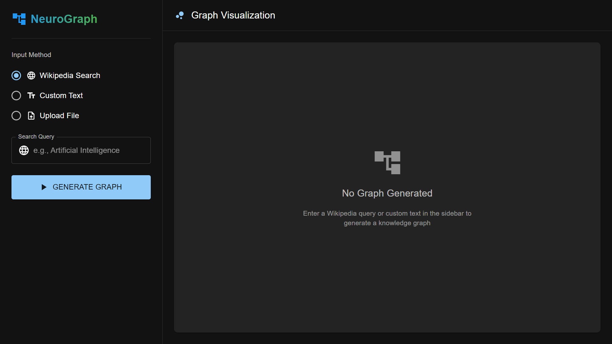
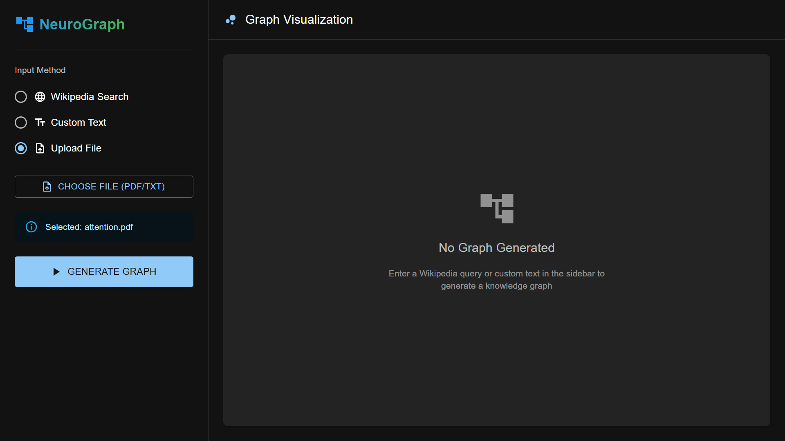
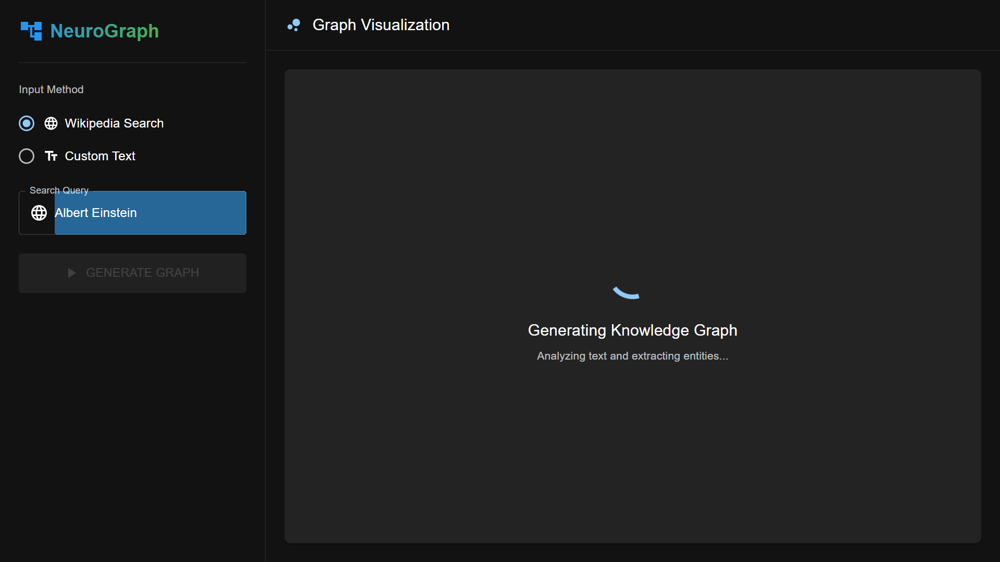
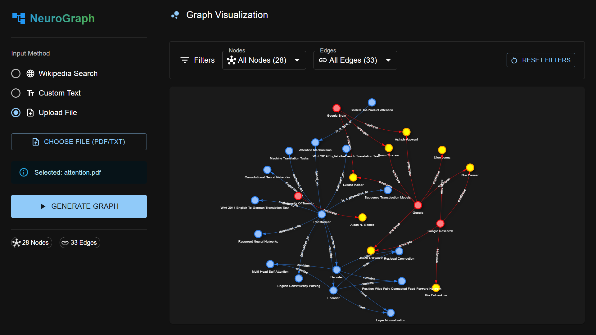
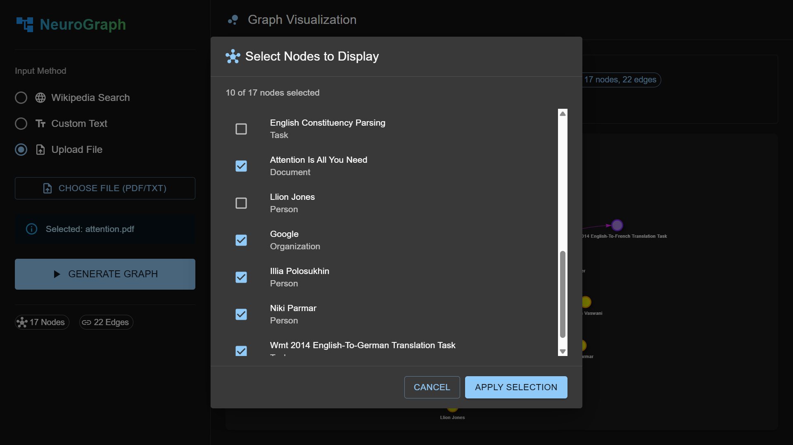

# **NeuroGraph** - Knowledge Graph Generator



A web application that generates interactive knowledge graphs from Wikipedia articles or custom text using advanced language models.

## Features

- **Wikipedia Search:** Search and extract content from any Wikipedia article.
- **Custom Text Input:** Generate graphs from your own text content.
- **AI-Powered Analysis:** Extracts entities and relationships using LLMs.
- **Interactive Visualization:** Explore and manipulate the generated graph with drag, zoom, and filter capabilities.
- **Advanced Filtering:** Customize which nodes and edges to display with dropdown filters and dialog selection.
- **Modern UI:** Built with Material-UI and React for a smooth user experience.

## Tech Stack

### Backend
- **FastAPI** - Python web framework
- **LangChain** - For AI-powered knowledge graph generation
- **OpenAI GPT-4** - For entity extraction and relationship identification
- **Wikipedia API** - For fetching article content

### Frontend
- **React 18** - UI library
- **TypeScript** - Type-safe JavaScript
- **Vite** - Fast build tool
- **Material-UI (MUI)** - Component library
- **vis-network** - Interactive graph visualization

## Getting Started

### Prerequisites

- Python 3.12 recommended
- Conda (Anaconda or Miniconda)
- Node.js (v18+ recommended)
- [OpenAI API Key](https://platform.openai.com/account/api-keys) **or** a GitHub access token (see note below)

> **Note:**  
> You can use a GitHub access token as the API key for the OpenAI client in this project.  
> See [here](https://github.com/marketplace/models) for more details.

### 1. Clone the Repository

```sh
git clone https://github.com/InduwaraGayashan001/Knowledge_Graph_App.git
cd Knowledge_Graph_App
```

### 2. Backend Setup

1. **Create conda environment:**

   ```sh
   conda create -n knowledge-graph python=3.12 -y
   ```

2. **Activate conda environment:**

   ```sh
   conda activate knowledge-graph
   ```

3. **Install dependencies:**

   ```sh
   pip install -r requirements.txt
   ```

4. **Set up environment variables:**

   - Create a `.env` file in your project root:
     ```
     OPENAI_API_KEY=your_openai_api_key_or_github_token
     ```

5. **Run the backend server:**

   ```sh
   cd app
   python main.py
   ```

- The backend will run at [http://localhost:8000](http://localhost:8000)

### 3. Frontend Setup

```sh
cd ui
npm install
npm run dev
```

- The frontend will run on [http://localhost:5173](http://localhost:5173)

## Customization

- **Model:** Change the LLM in [`app/generate_knowledge_graph.py`](app/generate_knowledge_graph.py).
- **Graph Appearance:** Edit visualization options in [`ui/src/components/GraphVisualization.tsx`](ui/src/components/GraphVisualization.tsx).
- **API Endpoints:** Customize endpoints in [`app/main.py`](app/main.py).

## Usage

1. Open the web app in your browser at [http://localhost:5173](http://localhost:5173)

    

2. Choose your input method:
   - **Wikipedia Search:** Enter a topic to search
   - **Custom Text:** Paste or type your own text

    

3. Click **GENERATE GRAPH** and wait while the AI extracts entities and relationships.

    

4. Once generated, explore the interactive graph:
   - **Drag nodes** to reposition them
   - **Zoom** in/out for better viewing
   - **Hover** over nodes to see details

    

5. Use the filter controls to customize your view:
   - Select **All Nodes** or **Custom Nodes** to filter specific entities
   - Select **All Edges** or **Custom Edges** to show specific relationships
   - Click **Reset Filters** to restore the complete graph

    

   
## NeuroGraph Demo

https://github.com/user-attachments/assets/6b795499-9ed4-45f2-9ac6-c75a96abdf0e

> **Important Notes:**  
> - If a Wikipedia search query doesn't exist or cannot be found, the application will return an error.
> - Text inputs that exceed the maximum token limit of **8000 tokens** will result in an error.
